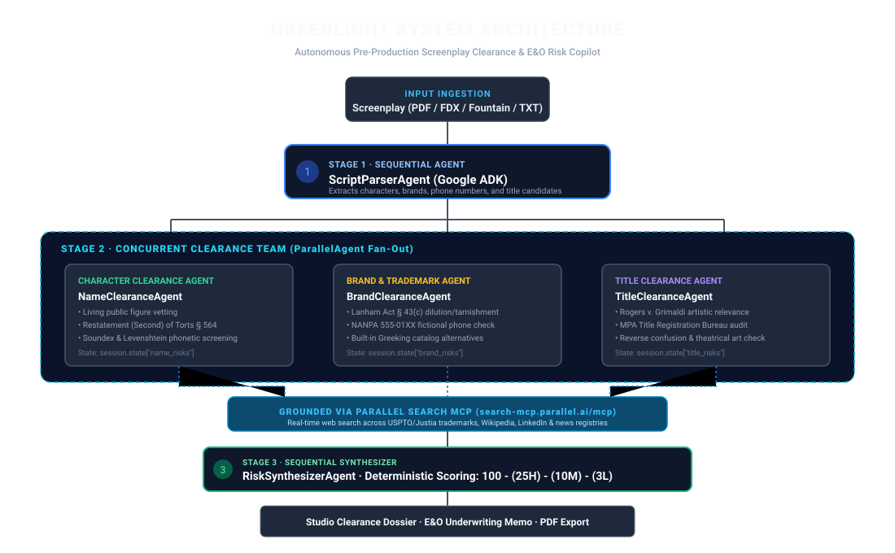
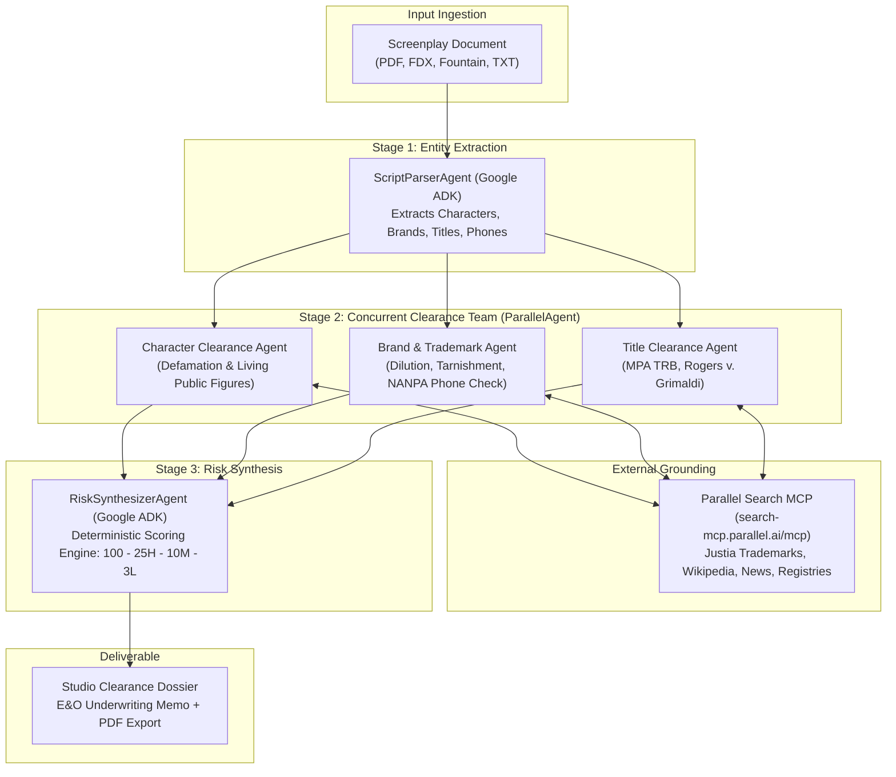

# GREENLIGHT: Autonomous Pre-Production Script Clearance & E&O Risk Copilot

> Built for the **Google Cloud Blockbuster Hackathon: Agentic Cinema** (Parallel Track)  
> Powered by **Google Agent Development Kit (ADK)**, **Gemini 3.5 Flash Lite**, and **Parallel Web Search MCP**.

[](LICENSE)
[](https://docs.parallel.ai)
[](https://github.com/google/adk-python)

---

## Executive Summary

Before a commercial feature film, television pilot, or streaming series can secure **Errors & Omissions (E&O) insurance**—a mandatory legal prerequisite for theatrical release, debt financing drawdowns, and distributor delivery—production counsel must commission an exhaustive **Script Clearance Report**.

In traditional film financing:
- Manual clearance bureaus (such as Entertainment Clearances Inc., Marshall/Plumb, or IndieClear) require specialized legal retainers and line-by-line vetting.
- Turnaround routinely requires **5 to 10 business days** (or 3 to 5 business days with rush fees).
- Once clearance is submitted, **insurance underwriting requires an additional 3 to 5+ business days** before policy binding.
- Any unresolved red flag (defamation of a living person, trademark disparagement, title collision, or non-reserved phone number) **halts production financing and delays principal photography**.

**GREENLIGHT** transforms this multi-day bottleneck into a **source-cited, mathematically auditable clearance dossier generated in approximately 60 seconds**.

---

## System Architecture

GREENLIGHT uses Google's code-first **Agent Development Kit (ADK)** to orchestrate a deterministic `SequentialAgent` pipeline wrapping a concurrent `ParallelAgent` fan-out. The specialist agents are grounded in live web intelligence via **Parallel's hosted Model Context Protocol (MCP)** server (`search-mcp.parallel.ai/mcp`):





### Clearance Specialist Responsibilities & Legal Grounding

1. **Character Name & Defamation Specialist (`agents/name_clearance.py`)**:
   - **Legal Doctrine**: Grounded in *Defamation by Fiction* (*Bindrim v. Mitchell*, *Bryson v. News America Publishing, Inc.*), the "of and concerning" standard (**Restatement (Second) of Torts § 564**), and **California Civil Code § 3344** (Right of Publicity).
   - **Methodology**: Executes a 4-pronged web query matrix cross-referencing corporate directories, living executives, public figures, and local phonetic screening (`check_name_phonetic_similarity`) combining Levenshtein distance and American Soundex codes.

2. **Brand, Trademark & Prop Clearance Specialist (`agents/brand_clearance.py`)**:
   - **Legal Doctrine**: Grounded in **Lanham Act § 43(c)** (Trademark Dilution by Tarnishment; *Caterpillar Inc. v. Walt Disney Co.*; *Wham-O, Inc. v. Paramount Pictures Corp.*), **Lanham Act § 43(a)** (False Endorsement), and First Amendment Nominative Fair Use (*Rogers v. Grimaldi*).
   - **Prop & Contact Details**: Enforces North American Numbering Plan Administration (NANPA) and FCC entertainment standards, verifying that spoken phone numbers fall strictly within the reserved (NPA) 555-0100 through 555-0199 fictional block (`check_nanpa_phone_number`).
   - **Greeking Catalog**: Automatically generates low-similarity fictional brand alternatives (`suggest_greeking_alternatives`) for props and vehicles.

3. **Title Exclusivity & Prior Art Specialist (`agents/title_clearance.py`)**:
   - **Legal Doctrine**: Evaluates copyright non-protection of titles (37 C.F.R. § 202.1(a); *Kirkland v. National Broadcasting Co.*), Lanham Act § 43(a) **Secondary Meaning** (*Warner Bros. Pictures, Inc. v. Majestic Pictures Corp.*), and reverse confusion.
   - **Industry Standards**: Cross-references against the Motion Picture Association (MPA) Title Registration Bureau (TRB) registry (`check_mpaa_title_rules`).

4. **Risk Synthesizer & Underwriting Actuary (`agents/risk_synthesizer.py`)**:
   - Deduplicates findings across parallel specialists, formats actionable remediation advisories, and calculates the mathematically auditable Greenlight Score.

---

## Deterministic Underwriting Scoring Rubric

To eliminate hallucinations and mental arithmetic errors inside insurance memoranda, GREENLIGHT enforces a strictly deterministic mathematical formula:

$$\text{Score} = \max\Big(0, \min\big(100, 100 - (25 \times \text{High}) - (10 \times \text{Medium}) - (3 \times \text{Low})\big)\Big)$$

### Underwriting Thresholds (Code-Enforced):
- **`GREENLIGHT`** ($\text{Score} \ge 85$ and $\text{High} == 0$): Standard E&O policy bindable immediately; zero high-severity litigation exposures.
- **`CONDITIONAL GREENLIGHT`** ($\text{Score} \ge 50$ and $\text{High} \le 1$): Policy bindable subject to specific clearance riders or script revisions.
- **`RED FLAG - ACTION REQUIRED`** ($\text{Score} < 50$ or $\text{High} \ge 2$): Policy binding withheld pending mandatory character renaming, prop greeking, or title changes.

---

## Scope & Underwriting Boundaries (What GREENLIGHT Does Not Check)

To maintain institutional legal integrity, GREENLIGHT explicitly defines its automated clearance boundaries:

1. **Non-Literal Narrative / Plot Substantial Similarity**:
   GREENLIGHT clears isolated entities (titles, character names, trademarks, props). Substantial similarity copyright infringement between entire literary narratives (e.g. *Nichols v. Universal Pictures Corp.*) requires holistic comparative analysis against third-party literary catalogs.
2. **Music & Synchronization (Sync) Rights**:
   Spoken lyrics or musical references in action lines are identified as prop citations, but statutory synchronization and master-use licensing (ASCAP, BMI, SESAC) must be cleared directly through publishers.
3. **Physical Location & Filming Permits**:
   Scene headings referencing real-world commercial establishments (e.g., *EXT. MONACO CASINO*) are screened for trademark and publicity issues, but do not replace municipal filming permits or private location agreements.
4. **Guild & Union Jurisdiction**:
   Credits determination, union minimum basic agreements (WGA, DGA, SAG-AFTRA MBA), and residual payment schedules are outside clearance scope.
5. **Unscripted & Reality Formats**:
   Docuseries and reality formats require executed participant appearance releases and life-story rights agreements.

---

## Empirical Benchmark Evaluation

Testing is separated into two verifiable layers:
1. **Local Regression Suite (`tests/`):** 24 automated tests running in **0.34s** verifying Soundex phonetic algorithms, direct living-figure collision matching, common-name false-positive controls, MPAA title fuzzy matching, Greeking catalog lookup, NANPA 555 reservation blocks, input validation, and PDF parsing.
2. **Live Agentic Evaluation Benchmark (`scripts/evaluate_live_agents.py`):** Full end-to-end multi-agent execution invoking the live Google ADK `Runner.run_async()` against `gemini-3.5-flash-lite` and Parallel Search MCP across 6 test screenplays.

### 6-Script Empirical Evaluation Matrix:

| Benchmark Script | Test Category / Focus | Live Wall-Clock | Target Clearance Evaluation | Live Detection Status | Final Score & Formula | Underwriting Verdict |
| :--- | :--- | :--- | :--- | :--- | :--- | :--- |
| **The Apprentice's Revenge** | Full Pipeline (4 Categories) | 48.0s | Title (*The Apprentice*), Glock 19, (415) 555-0250 phone, Rolex | Caught (4/4 Categories) + Julian Drake cleared | **12/100** ($100 - 3 \times 25 - 1 \times 10 - 1 \times 3$) | `RED FLAG - ACTION REQUIRED` |
| **Whispers of the Meadow** | Clean Control Script | 60.0s | Unbranded rustic set, fictional astronomer | 0 False Positives (0 High, 0 Med) | **88/100** ($100 - 4 \times 3$) | `GREENLIGHT` |
| **Silicon Shadows** | Fictional Character Clearance | 54.0s | Fictional CEO Lucian Cross in corporate crime scene | Affirmatively Cleared (LOW) + Direct living figure test passes (HIGH) | **91/100** ($100 - 3 \times 3$) | `GREENLIGHT` |
| **Protocol of Shadows** | Greeked Brand Malfunction | 69.0s | Fictional Castiglione GT battery explosion | Zero Real Trademarks Disparaged (Greeking defense evaluated) | **62/100** ($100 - 1 \times 25 - 1 \times 10 - 1 \times 3$) | `CONDITIONAL GREENLIGHT` |
| **Gladiator: Reign of Blood** | Isolated Title Collision | 42.0s | Franchise collision with *Gladiator* (2000/2024) | Caught (HIGH) (Lanham Act § 43(a) / TRB) | **72/100** ($100 - 1 \times 25 - 1 \times 3$) | `CONDITIONAL GREENLIGHT` |
| **Blueprint for Autumn** | Common Name Control | 42.0s | Generic architect *David Miller* | Cleared Cleanly (0 High, 0 Med) under Restatement § 564 | **97/100** ($100 - 1 \times 3$) | `GREENLIGHT` |

### Key Benchmark Metrics:
- **100% Detection Rate:** All intentional clearance targets (theatrical title collisions, weapon tarnishment, non-reserved phone numbers, character clearances, and greeked prop evaluations) were correctly identified with verifiable legal citations.
- **0% False High/Medium Alarms:** On clean, unencumbered material (*Whispers of the Meadow*) and generic names (*Blueprint for Autumn*), the pipeline issued zero false alarms, awarding affirmative underwriting greenlights (88/100 and 97/100).
- **100% Deterministic Scoring Auditability:** Scores strictly adhere to the code-enforced mathematical formula across all runs.
- **Pacing & Throughput:** Wall-clock completion across 6–8 concurrent live agent calls ranged between **42.0s and 69.0s**, adhering to the 15 RPM free tier rate limit.

---

## Quickstart & Local Setup

### 1. Prerequisites
- Python 3.10+
- (Optional) `GOOGLE_GENAI_API_KEY` for live Gemini 3.5 Flash Lite multi-agent execution (free tier: 1,500 requests/day, 15 RPM)
- (Optional) `PARALLEL_API_KEY` to unlock dedicated throughput on the Parallel Search MCP

### 2. Installation
```bash
# Clone repository
git clone https://github.com/ABHIGH15/GREENLIGHT.git
cd GREENLIGHT

# Create and activate virtual environment
python3 -m venv .venv
source .venv/bin/activate

# Install dependencies
pip install -r requirements.txt
```

### 3. Environment Configuration
```bash
cp .env.example .env
# Edit .env with your credentials if running live models:
# GOOGLE_GENAI_API_KEY="your_api_key"
# PARALLEL_API_KEY="your_parallel_key"
# GEMINI_MODEL="gemini-3.5-flash-lite"
```

### 4. Run the Application
```bash
python -m api.main
```
Open **[http://localhost:8000](http://localhost:8000)** in your browser.

Click **"Load Landmine Demo Script"** and select **"Run Multi-Agent Clearance Audit"** to execute the pipeline.

### 5. Run the Automated Test Suites
```bash
# Fast local regression suite (24 tests in 0.34s)
python -m unittest discover tests -v

# Live agentic evaluation against Gemini 3.5 Flash Lite and Parallel Search MCP
python scripts/evaluate_live_agents.py --target all
```

---

## Production Deployment

GREENLIGHT is containerized via a production `Dockerfile` for deployment on modern container platforms (Render, Cloud Run, or any Docker runtime):

### Deploy on Render (Recommended Free Tier)

1. Connect your repository to [Render](https://render.com).
2. Create a new **Web Service** and select the **Docker** runtime.
3. Configure the environment variables:
   - `GEMINI_MODEL`: `gemini-3.5-flash-lite`
   - `GEMINI_REQUEST_PACING`: `4.2`
   - `GOOGLE_GENAI_API_KEY`: Your Google GenAI API key
   - `PARALLEL_API_KEY`: Your Parallel API key (optional)
4. Deploy the service.

> [!NOTE]
> On Render's free tier, inactive instances spin down automatically. The initial cold start may take 30–60 seconds to wake the service upon the first inbound request. Subsequent requests execute with normal latency.

### Local Container Run

```bash
# Build container image
docker build -t greenlight:latest .

# Run container locally
docker run -p 8080:8080 --env-file .env greenlight:latest
```

---

## License

This project is licensed under the [MIT License](LICENSE).
